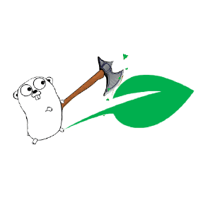

# Proof of Space



This is an alternative implementation of the [Chia](https://www.chia.net/) Proof of Space algorithm.
If you are into Golang and think Proofs of Space sounds cool, feel free to contribute!

**WARNING:** This is an academic prototype, and **NOT** ready for production use. If you want to use proofs of space in
your project or run a Chia farmer, you should use the [reference implementation](https://github.com/Chia-Network/chia-blockchain).


## Build

[Golang](https://golang.org/) (1.13+) is the only requirement to build this project.
Once you have it installed:
```
make build
```

## Run

Plot your disk with:
```
./bin/plotter
```
If no plot seed is provided via a file, a random one will be generated at `.seed`.

Now, search for a proof. We can provide a challenge via the `-c` flag. If no challenge is provided, a random challenge
is generated and persisted at `.random_challenge`. It may happen that we will not find a proof of space immediately
because none exists for the provided challenge. If so, try with a different challenge until one is found.
```
./bin/prover
```
Once we find a proof, we can reproduce the proof retrieval by using the persisted random challenge:
```
./bin/prover -c "$(cat .random_challenge)" > .proof
```

Now that we have also persisted the proof, we can verify it:
```
./bin/verifier -key .seed -p $(cat .proof) -c "$(cat .random_challenge)"
```

## Contribute

### Run tests

```
make test
```

### Run code verification

```
make verify
```

### Run benchmarks

```
make bench
```

### Aknowledgements

* btcsuite (for the logo and high code standards)

